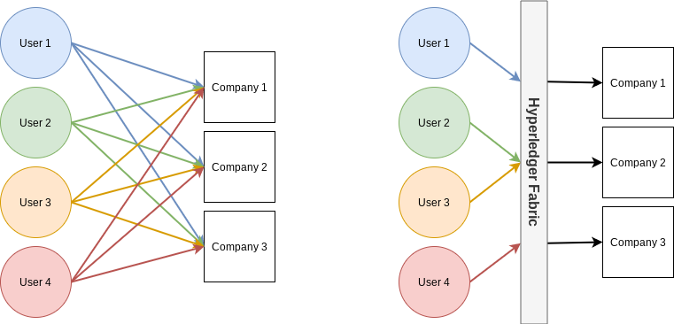

# dApp 1 Project
This is a simple project as a first exposure to Hyperledger Fabric.

## eKYC - a Hyperledger Fabric project

Luka Buzaladze (React - Frontend)
Deepanshu Gupta (Hyperledger Fabric - Backend)  
Aaron Lu (Express - API)  

### Goal

Know your client (KYC) laws are a common way to protect investors and investments. However, many companies require a user to fill out the similar KYC applications over and over again. eKYC aims to solve this problem where the user is able to fill out a single KYC form, and approve the information for various companies.

A common question may be: why not just use a database that is shared between companies? The answer lies in the trust question - would another company trust other companies to not manipulate the data? The answer is commonly no. However, the Hyperledger Fabric solution allows for each company to host a record that can be checked against other company nodes to form an immutable record.

_Note: user is defined as an individual person who is submitting KYC information, where as company is an account that is used to view peoples' information._

### Architecture & Implementation

The user and company facing interface is a React front end that connects to a Express API that is connected to a Hyperledger Fabric network.

Using the front-end the user is able to input information, view which companies they have approved to view their information, and approve additional companies. The companies are able to login and view the information for users that have approved them to view the information.

Identification is managed using JSON web tokens (JWT) and Node.js crypto hashing/encoding/decoding functions. The JSON web token is used to identify user or company's username and hashed password. Using the username + password, a users ID can be created by hashing, and a company's ID can be created by encoding. The purpose of using encoding is that a list of company IDs can be decoded for a list of company names. In all cases, the original password will be in hashed format for security purposes. Information is retrieved based on the ID which is unique for each user and company.

The reasoning behind a simplistic authentication is to reduce the complexity of the overall system without needing to worry about password management. However, in a real setting this would not be an appropriate system - this project is a simple demonstration of connecting a front-end to a Hyperledger Fabric backend using an API.

### Modeling
  
*Diagram showing the flow of KYC information. The left figure illustrates the system today where each user must provide information to each company. The right figure illustrates the eKYC system where each user provides information once and companies can get the information when they are approved.*

Mathematical modeling/reasoning:
```
n = number of users
m = number of companies
c = number of connections

Traditional System:
c = m * n

eKYC System:
c = m + n
```

  
*Simple model for showing the connection points between the front end, API layer, and Hyperledger Fabric*

### Data/Parameters

| Variable Name | Type     | Details                                                                                                                    | Notes                                                                                            |
| ------------- | -------- | -------------------------------------------------------------------------------------------------------------------------- | ------------------------------------------------------------------------------------------------ |
| user          | `Object` | {`userId`, `firstName`, `lastName`, `DOB`, `income`, `passport`} | data structure for each individual person                                                        |
| relations     | `Object` | [{ `companyId`, `userId`}, ...] | a list of paired company ids and user ids to track approval |
| companies | `Array` | [`companyId`, ...] | list of all company ids |
| token         | `String` |                                                                                                                            | token used in API calls for authentication, parsed token used to form userId                     |

### Functions

| Functions      | Inputs (front-end to API)  | Inputs(API to chaincode) | Output (chaincode)            | Output (API)   | Notes                                                                                                                                                                      |
| -------------- | -------------------------- | ------------------------ | ----------------------------- | -------------- | -------------------------------------------------------------------------------------------------------------------------------------------------------------------------- |
| inputData      | `user` object       | {`userId`, `user` object}    | --                            | userId         | store user data                                                                                                                                                            |
| approveCompany | `companyId`                  | {`userId`, `companyId`}      | --                            | `boolean`        | takes a users data and inputs it into the companies data                                                                                                                   |
| getData        | --                         | `userId`                   | `user` object                   | `user` object    | gets individuals data for KYC information                                                                                                                                  |
| saveCompany | N/A | `companyId` | -- | N/A | Used to save companyId to list of company ids  |
| getCompanies | N/A | -- | [`companyId`, ...] | N/A | gets a list of all approved and registered companies |
| getRelations   | -- | {`key`, `userId` or `companyId`}      | [`companyId`, ...] or [`userId`, ...] | -- | for company - function to get userIds that have approved then return associated user information, for user - function to get approved companyIds then return company names |
| getToken       | `payload`                    | N/A                      | N/A                           | `token`          | used for providing authentication token to front-end                                                                                                                       |
| checkToken     | `token`                      | N/A                      | N/A                           | `boolean`        | used to check validity of token - only called in API/Express                                                                                                               |

### API Endpoints

Token should be passed whenever interacting with the API other than the `\login` POST call.

| Endpoint     | Type  | Input                    | Output                                      | Functionality                                               | Called By |
| ------------ | ----- | ------------------------ | ------------------------------------------- | ----------------------------------------------------------- | --------- |
| `\login`     | `get` | token | true/false                                       | check if token is valid or not                              | both      |
| `\login`     | `post` | username, password, type                    | token                                  | login endpoint to generate token                            | both      |
| `\user`      | `get` | token                    | user information                            | get user information                                        | user      |
| `\user`      | `post` | token, payload           | true/false                                  | store user information                                      | user      |
| `\corporate` | `get` | --                       | array of user objects                       | get information that is approved for company                | company   |
| `\approve`   | `get` | --                       | array of approved companies + all companies | get a list of approved companies and all possible companies | user      |
| `\approve`   | `post` | companyId                | true/false                                  | approve company for user information                        | user      |

### Installation + Deployment Instructions
Starting in the home directory (`~/`), install Prerequisites (for Ubuntu):
```
curl -O https://hyperledger.github.io/composer/v0.19/prereqs-ubuntu.sh
chmod u+x prereqs-ubuntu.sh
./prereqs-ubuntu.sh
```

Install Hyperledger Fabric (v1.4)
```
curl -sSL http://bit.ly/2ysbOFE | bash -s -- 1.4.4 1.4.4 0.4.18
```

Test the network
```
cd ~/fabric-samples/fabcar
./startFabric.sh javascript
docker ps
```
There should be various docker containers indicating a successful startup of the fabric system.

Install the the eKYC code in the chaincode directory and move the start script to the fabcar folder
```
cd ../chaincode
git clone https://github.com/deepcrazy/eKYC_chaincode eKYC
mv ./eKYC/start_ekyc.sh ../fabcar
```
If necessary change the permissions on the `start_ekyc.sh` script and run
```
cd ../fabcar
chmod 777 start_ekyc.sh
./start_ekyc.sh
```
Get the API code from the repository
```
cd
git clone https://github.com/aalu1418/dApp1_project
```
Copy the `connection-org1.json` from the `fabric-samples/first-network` folder to the `api\config` folder
```
cd ~/dApp1_project/api
mkdir config
cp ~/fabric-samples/first-network/connection-org1.json ~/dApp1_project/api/config/connection-org1.json
```
Install packages, enroll admin and user, and start server.
```
npm install
node enrollAdmin.js
node registerUser.js
npm start
```
This will start the express server at `http://localhost:3000`. If you are in GCP, it will start the server at `http://<your GCP external IP>:3000`. Please note that you have to enable the firewall rules to allow port 3000 to be exposed in your GCP Compute Engine.

Then from your local machine, deploy the code in the `frontend` folder using `npm start`.


### Resources

- [JSON Web Token](https://github.com/auth0/node-jsonwebtoken)
- [Hyperledger Fabric - v1.4](https://hyperledger-fabric.readthedocs.io/en/release-1.4/)
- [Hyperledger Fabric - FabCar](https://hyperledger-fabric.readthedocs.io/en/release-1.4/write_first_app.html)
- [Node.js Crypto](https://nodejs.org/api/crypto.html)
- [Persistent Background App on VM](https://superuser.com/questions/1110574/keeping-a-java-app-running-when-ssh-is-closed-on-google-cloud)
