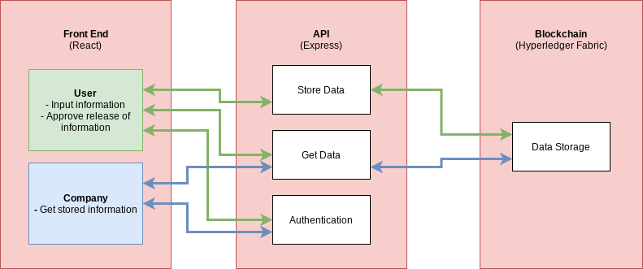

# dApp 1 Project
This is a simple project as a first exposure to Hyperledger Fabric.

## eKYC - a Hyperledger Fabric project

Luka Buzaladze  
Deepanshu Gupta  
Aaron Lu

### Goal

Know your client (KYC) laws are a common way to protect investors and investments. However, many companies require a user to fill out the similar KYC applications over and over again. eKYC aims to solve this problem where the user is able to fill out a single KYC form, and approve the information for various companies.

### Data/Parameters

| Variable Name | Type     | Details                                                                                                                    | Notes                                                                                            |
| ------------- | -------- | -------------------------------------------------------------------------------------------------------------------------- | ------------------------------------------------------------------------------------------------ |
| user          | `Object` | {userId: `number`, firstName: `string`, lastName: `string`, DOB: `number (seconds)`, income: `number`, passport: `number`} | data structure for each individual person                                                        |
| relations     | `Object` | [{ `companyId`, `userId`}] | a list of paired company ids and user ids to track approval |
| companies | `Array` | [companyIds] | list of all company ids |
| token         | `String` |                                                                                                                            | token used in API calls for authentication, parsed token used to form userId                     |

### Functions

| Functions      | Inputs (front-end to API)  | Inputs(API to chaincode) | Output (chaincode)            | Output (API)   | Notes                                                                                                                                                                      |
| -------------- | -------------------------- | ------------------------ | ----------------------------- | -------------- | -------------------------------------------------------------------------------------------------------------------------------------------------------------------------- |
| inputData      | Object (user object)       | {userId: user object}    | --                            | userId         | store user data                                                                                                                                                            |
| approveCompany | companyId                  | {userId, companyId}      | --                            | boolean        | takes a users data and inputs it into the companies data                                                                                                                   |
| getData        | --                         | userId                   | user object                   | user object    | gets individuals data for KYC information                                                                                                                                  |
| saveCompany | N/A | companyId | -- | N/A | Used to save companyId to list of company ids  |
| getCompanies | N/A | -- | array of company ids | N/A | gets a list of all approved and registered companies |
| getRelations   | key type (user or company) | key type, userId or companyId      | list of companyIds or userIds | Array[Objects] | for company - function to get userIds that have approved then return associated user information, for user - function to get approved companyIds then return company names |
| getToken       | payload                    | N/A                      | N/A                           | token          | used for providing authentication token to front-end                                                                                                                       |
| checkToken     | token                      | N/A                      | N/A                           | boolean        | used to check validity of token - only called in API/Express                                                                                                               |

### API Endpoints

| Endpoint     | Type  | Input                    | Output                                      | Functionality                                               | Called By |
| ------------ | ----- | ------------------------ | ------------------------------------------- | ----------------------------------------------------------- | --------- |
| `\login`     | `get` | username, password, type | token                                       | check if token is valid or not                              | both      |
| `\login`     | `put` | token                    | true/false                                  | login endpoint to generate token                            | both      |
| `\user`      | `get` | token                    | user information                            | get user information                                        | user      |
| `\user`      | `put` | token, payload           | true/false                                  | store user information                                      | user      |
| `\corporate` | `get` | --                       | array of user objects                       | get information that is approved for company                | company   |
| `\approve`   | `get` | --                       | array of approved companies + all companies | get a list of approved companies and all possible companies | user      |
| `\approve`   | `put` | companyId                | true/false                                  | approve company for user information                        | user      |

### Modeling

### Architecture

The user and company facing interface is a React front end that connects to a Express API that is connected to a Hyperledger Fabric network.

### Deployment Instructions

### Resources

- [JWT](https://github.com/auth0/node-jsonwebtoken)
